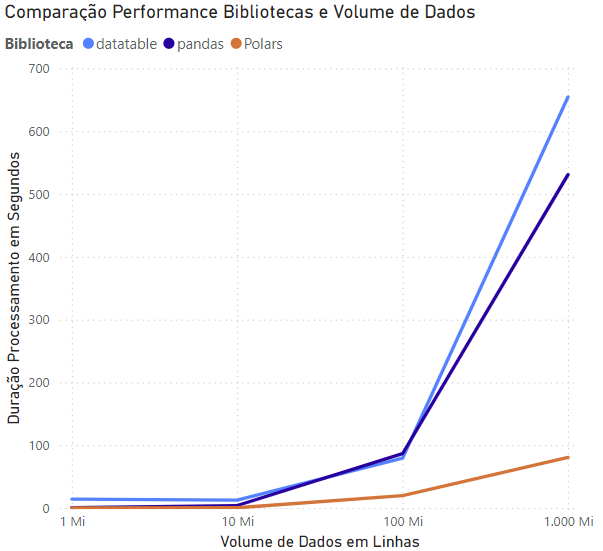

# Jornada de Dados. Bootcamp Python. Aula 05 <br><br> Um Bilhão de Linhas: Desafio de Processamento de Dados com Python

Nessa aula, a proposta era fazer um clone do repositório [One-Billion-Row-Challenge-Python](https://github.com/lvgalvao/One-Billion-Row-Challenge-Python) e realizar melhorias no código. Ao invés de fazer isso, eu de fato reimplementei o projeto com as seguintes melhorias:

- Ambiente de desenvolvimento: configuração do pre-commit com hooks para melhoria da padronização e qualidade do código.

- Criação de docstrings para documentação seguindo o padrão NumPy. Com isso, é possível usar o Mkdocs para geração da documentação de forma ágil.

- Criação de módulo para testar em sequência de cenários com aumento de linhas.

- Estratégia para agilizar a integração de novas implementações.

- Geração de arquivo csv com os resultados dos testse com a seguinte estrutura: <biblioteca>;<número de linhas>;<horário de início>;<tempo de execução (s)>.

Esse readme é uma versão atualizada do repositório [One-Billion-Row-Challenge-Python](https://github.com/lvgalvao/One-Billion-Row-Challenge-Python).

## Introdução

O objetivo deste projeto é demonstrar como processar eficientemente um arquivo de dados massivo contendo 1 bilhão de linhas (~14GB), especificamente para calcular estatísticas (Incluindo agregação e ordenação que são operações pesadas) utilizando Python. Diferentemente do original, foi implementada um script para testar cenários com diferentes quantidades de linhas. A ideia foi treinar as estruturas de repetição e criar uma estrutura para facilitar a integração de novas bibliotecas para testar.

Este desafio foi inspirado no [The One Billion Row Challenge](https://github.com/gunnarmorling/1brc), originalmente proposto para Java.

O arquivo de dados consiste em medições de temperatura de várias estações meteorológicas. Cada registro segue o formato `<string: nome da estação>;<double: medição>`, com a temperatura sendo apresentada com precisão de uma casa decimal.

Aqui estão dez linhas de exemplo do arquivo:

```
Hamburg;12.0
Bulawayo;8.9
Palembang;38.8
St. Johns;15.2
Cracow;12.6
Bridgetown;26.9
Istanbul;6.2
Roseau;34.4
Conakry;31.2
Istanbul;23.0
```

O desafio é desenvolver um programa Python capaz de ler esse arquivo e calcular a temperatura mínima, média (arredondada para uma casa decimal) e máxima para cada estação, exibindo os resultados em uma tabela ordenada por nome da estação.

| station      | min_temperature | mean_temperature | max_temperature |
|--------------|-----------------|------------------|-----------------|
| Abha         | -31.1           | 18.0             | 66.5            |
| Abidjan      | -25.9           | 26.0             | 74.6            |
| Abéché       | -19.8           | 29.4             | 79.9            |
| Accra        | -24.8           | 26.4             | 76.3            |
| Addis Ababa  | -31.8           | 16.0             | 63.9            |
| Adelaide     | -31.8           | 17.3             | 71.5            |
| Aden         | -19.6           | 29.1             | 78.3            |
| Ahvaz        | -24.0           | 25.4             | 72.6            |
| Albuquerque  | -35.0           | 14.0             | 61.9            |
| Alexandra    | -40.1           | 11.0             | 67.9            |
| ...          | ...             | ...              | ...             |
| Yangon       | -23.6           | 27.5             | 77.3            |
| Yaoundé      | -26.2           | 23.8             | 73.4            |
| Yellowknife  | -53.4           | -4.3             | 46.7            |
| Yerevan      | -38.6           | 12.4             | 62.8            |
| Yinchuan     | -45.2           | 9.0              | 56.9            |
| Zagreb       | -39.2           | 10.7             | 58.1            |
| Zanzibar City| -26.5           | 26.0             | 75.2            |
| Zürich       | -42.0           | 9.3              | 63.6            |
| Ürümqi       | -42.1           | 7.4              | 56.7            |
| İzmir        | -34.4           | 17.9             | 67.9            |

## Dependências

Para executar os scripts deste projeto, você precisará das seguintes bibliotecas:

* Python = '^3.12'

* Pandas = '^2.2.3'

* tqdm = '^4.67.1'

* Polars = '^1.19.0'

* datatable = "^1.1.0"

## Resultados

Os testes foram realizados em uma isntalação do Ubuntu 24.04.1 LTS no WSL do Windows 11. O notebook é um Dell Inspiron 15 5510, processador 11th Gen Intel(R) Core(TM) i7-11390H @ 3.40GHz   2.92 GHz e 16GB memória ram.

As implementações utilizaram abordagens de Python com pandas, Polars e datatable. Foram testadas diversas quantidades de linhas, conforme os resultados podem ser vistos no gráfico abaixo.



Vemos que das opções testadas o Polars é a que apresenta melhor performance. Entre 10M e 100M, as implementações da datatable e da pandas são bem próximas. Importante: para implementar a datatable foi necessária o uso de uma estratégia de processamento em lotes manual, dado que essa biblioteca não possui esse tipo de processamento nativo.

Existem outras tecnologias que poderiam ter sido usadas como duckDB, pyspark, entre outras. Contudo, optei por usar somente essas três como forma de estudo. Utilizarei essas outras tecnologias em outros projetos.

Obrigado por [Koen Vossen](https://github.com/koenvo) pela implementação em Polars.

## Como Executar

Para executar este projeto e reproduzir os resultados:

1. Clone esse repositório. <br><br>
Se você usar o GitHub CLI, use: `gh repo clone gregomelo/bootcamp_py_aula_05`.<br><br>
Se você usar somente o Git, use: `git clone https://github.com/gregomelo/bootcamp_py_aula_05.git`.<br><br>
2. Confirmar que o ambiente está com as bibliotecas `pyenv` e `poetry` instaladas.<br><br>
3. Definir a versao do Python usando o `pyenv local 3.12.8`.<br><br>
4. Confirmar e instalar o projeto usando os códigos `poetry env use 3.12.8`, `poetry install --no-root` e `poetry lock --no-update`.<br><br>
5. Ative o ambiente virtual usando o comando `poetry env activate`.<br><br>
6. Para executar o teste com somente uma quantidade única de linhas, execute o comando `python src/create_measurements.py` para gerar o arquivo de teste.<br><br>
7. Tenha paciência e vá fazer um café, vai demorar uns 10 minutos para gerar o arquivo.<br><br>
8. Certifique-se de instalar as versões especificadas das bibliotecas pandas, Polars e datatable.<br><br>
9. Execute o script `python src/record_result.py`.<br><br>
10. Para executar os testes com diferentes quantidade de linhas, `python src/run_tests.py` para criar o arquivo para processamento e, em seguida, aplicar as soluções implementadas.<br><br>
10. Verifique os resultados no arquivo `data/solution_results.csv`. No repositório é possível ver o arquivo com teste com diversas quantidade de linhas.<br><br>

Este projeto destaca a versatilidade do ecossistema Python para tarefas de processamento de dados, oferecendo valiosas lições sobre escolha de ferramentas para análises em grande escala.

## Próximos passos

Esse projeto faz parte da *Jornada de Dados*
Nossa missão é fornecer o melhor ensino em engenharia de dados

Se você quer:

- Aprender sobre Duckdb e engenharia de dados
- Construir uma base sólida em Python e SQL
- Criar ou melhorar seu portfólio de dados
- Criar ou aumentar o seu networking na área
- Mudar ou dar o próximo passo em sua carreira

A Jornada de Dados é o seu lugar

[](https://suajornadadedados.com.br/)
